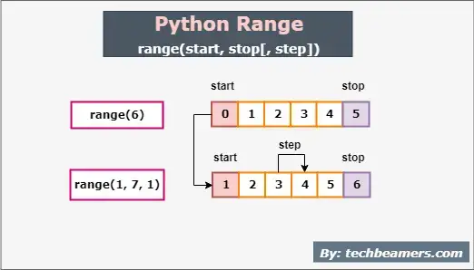
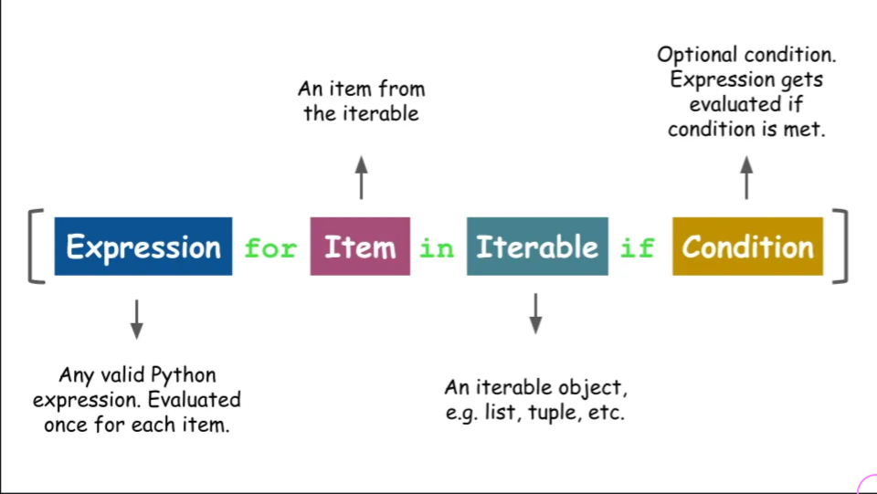

<h2>Python Data Structures 🏗️</h2>


---

<h3><strong> ✅ Objectives </strong></h3>

- Review the Sequence types: `list`, `tuple`, `range` (and `str`)
  - Lists: understand CRUD operations with list values
  - Tuples: 
      - Discuss: `mutable` vs `immutable`
      - Create and access values in tuples
 
xxx

  - Ranges: and how they're useful in loops
  - Learn about Set types (time permitting)
- Dictionaries:
  - a mapping data structure
  - know all CRUD operations
- Loops: create `for` and `while` loops with sequences
- Use list comprehensions to emulate JS `map`, `filter` and `find` functions

---

<h3>List... array's Pythonic twin?</h3>

- ordered collection of elements
- aka sequence
- mutable

<pre>
  <code class="language-python">
  my_list = ["hello", "world", 42, ["another", "list"]]
  </code>
</pre>

---

<div style="display: flex; flex-direction: column;">
  <div>
    
  </div>

  <div style="font-size: 1.5rem; margin: 0.85rem 1rem;">
    Let's dive into the code! 🌊
  </div>
</div>

---

<h3>Tuples–when values are forever 💎</h3>

- ordered collection of values
- aka sequence
- **_immutable_**

<pre>
  <code class="language-python">
    my_tuple = (4, 2, "Miyuki", True)
  </code>
</pre>


---


<pre>
  <code class="language-python">
    for num in range(8):
      print(f"The count is {num}")
  </code>
</pre>

---

<h3>Dictionaries 📖 Python's JSON</h3>

<h5>Creating dictionaries:</h5>
<pre>
  <code class="language-python">
    cat_1 = {
      'name': 'Simon',
      'color': 'ginger',
      'age': 10
    }
  </code>
  <code class="language-python">
    cat_2 = dict(name='Miyuki', color='grey', age=10)
  </code>
</pre>

---

<h5>Reading and adding values 👓</h5>

<pre><code class="language-python" data-line-numbers="1-5|6-7|8-9|10-11|12-13">cat_1 = {
      'name': 'Simon',
      'color': 'ginger',
      'age': 10
}
cat_1['color']
# => ginger
cat_1.get('age')
# => 10
cat_1.get('mood')
# => None
cat_1['mood'] = 'hungry'
cat_1.setdefault('breed', 'Munchkin')
</code></pre>

<h6 class="fragment">Let's try it! 🚀</h6>

---

<h5>Updating and Deleting values 📝 ❌</h5>

<pre><code class="language-python" data-line-numbers="1-6|7-10|11-14">cat_1 = {
      'name': 'Simon',
      'color': 'ginger',
      'age': 10,
      'mood': 'hungry'
}
cat_1['mood'] = 'sleepy'
cat_1.update(age=11, mood='feisty')
print(cat_1)
# {'name': 'Simon', 'color': 'ginger', 'age': 11, 'mood': 'feisty'}
del cat_1('age')
cat_1.pop('mood')
print(cat_1)
# {'name': 'Simon', 'color': 'ginger'}
</code></pre>

<h6 class="fragment">Let's do it! 🛠️</h6>

---

<h5><code>For</code> loops: let me reiterate 🐈🐈🐈</h5>


---

#### `break` keyword 🔑

<div style="font-size: 1.5rem">
In a loop, the <code>break</code> keyword escapes the loop, regardless of the iteration number. Once <code>break</code> executes, the program will continue to execute after the loop.
</div>


```python
numbers = [0, 254, 2, -1, 3]

for num in numbers:
  if (num < 0):
    print("Negative number detected!")
    break
  print(num)
  
# 0
# 254
# 2
# Negative number detected!

```

---

#### `continue` keyword 🔑

<div style="font-size: 1.5rem">
In Python, the <code>continue</code> keyword is used inside a loop to skip the remaining code inside the loop code block and begin the next loop iteration.
</div>


```python
big_number_list = [1, 2, -1, 4, -5, 5, 2, -9]

# Print only positive numbers:
for i in big_number_list:
  if i < 0:
    continue
  print(i)

```

---

#### `while` loops 🔍

<div style="font-size: 1.5rem">
In Python, a <code>while</code> loop will repeatedly execute a code block as long as a condition evaluates to <code>True</code>.
</div>

```python
hunger = 5
while hunger > 0:
  print('munch!')
  hunger -= 1 # be sure to progress your condition towards the base case!
# this will print 'munch!' 5 times

```

---

#### List Comprehension 💡

<div style="font-size: 1.5rem">
List comprehension is a simpler method to create a list from an existing list. It is generally a list of iterables generated with an option to include only the items which satisfy a condition.
</div>



---

