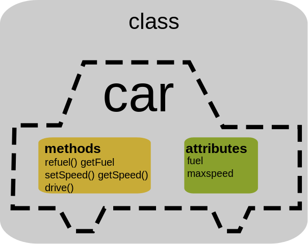
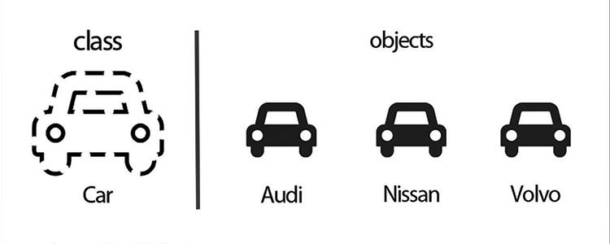
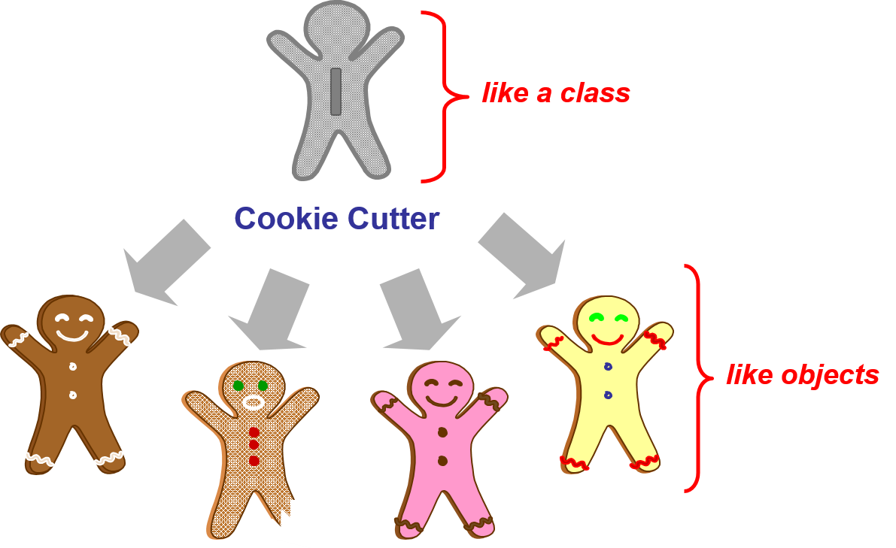
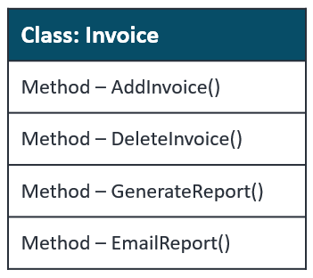
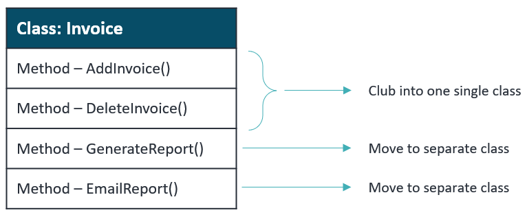
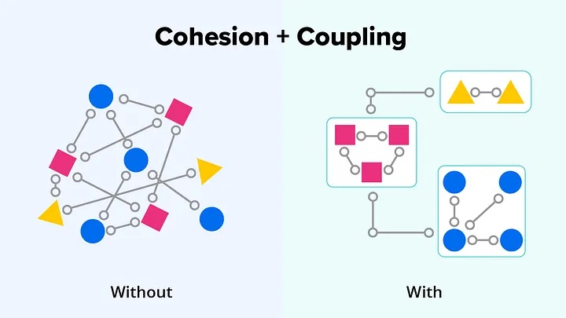
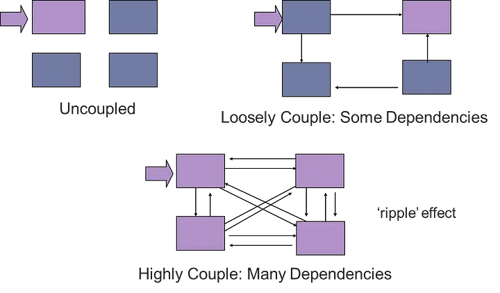
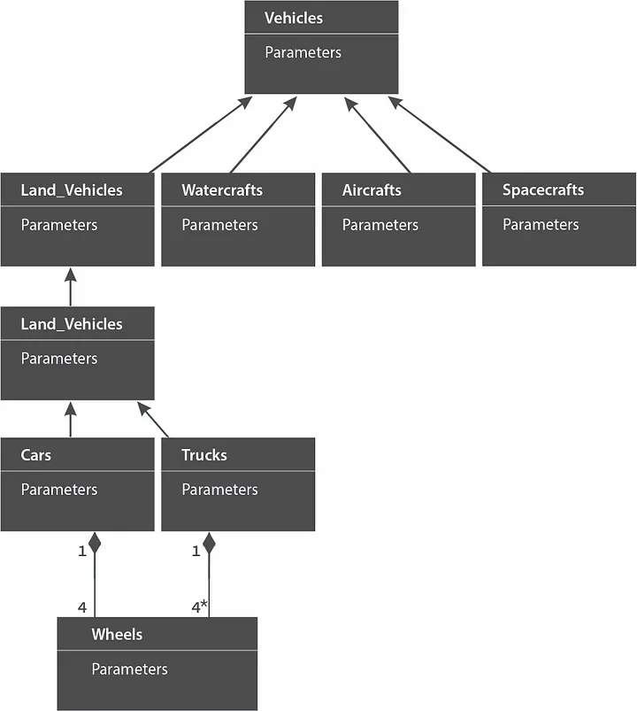
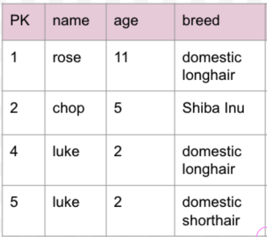

<h2>Object-Oriented Programming in Python</h2>

---

<h3><strong> ✅ Objectives </strong></h3>

* Define Object-Oriented Programming
* Understand the benefits of OOP
* Build Classes
* Create instances of those classes
* Use `__init__` to instantiate objects with attribute values

xxx

* Add instance methods to our classes
* Understand the use of the `self`` keyword in instances
* Know the principles of OO Design
* Stretch: object properties, mass assignment

---

<h3>What is OOP? 🤔</h3>

* a programming paradigm  
* seeks to encapsulate information and it's related behaviors together as objects
* models concepts and objects in the real world. 
* easier to reason about and solve problems involving those data, 
* facilitates structuring our programs in ways that can share and reuse these objects.
* contrast to Procedural Programming, 
  * written in sequential order and 
  * procedures are called when behaviour needs to be shared between pages in an application.

---

---

<section data-background-color="mistyrose" >
  <h3>Classes and Instances</h3>
  
</section>

---

### A Python Class is...

* a blueprint or template for creating individual objects
* a data structure which assigns values and methods to objects

  

    
  

  

    
  

---

### An object is...

  

    <ul>
      <li> an individual collection of variables (attributes), functions (methods), and data structures</li>
      <li> constructed from a class</li>
      <li> also called an 'instance'</li>
      <li> a representation of a real world object or event</li>
    </ul>
  

  

    
    
  

---

#### You actually already have some experience with classes and instances!

<pre>
  <code class="language-python" data-trim >
    type("hello") # => < class 'str'>
    42.__class__ # => < class 'int'>
  </code>
</pre>

What happens when you enter <code>dir("world")</code> in a Python shell?

#### Let's build a class and some instances! 👷

---

#### Some strengths of OOP

* having total control of what objects look like just by updating their class

#### Some weaknesses of OOP

* becuase my objects have to conform to a class, I lose flexibility in changing their attributes without changing the class

---

#### Example Application Domains

* healthcare {.fragment}
* FinTech/banking {.fragment}
* insurance {.fragment}
* sales {.fragment}
* eCommerce {.fragment}
* accounting {.fragment}
* booking software for hospitality and travel {.fragment}

---

#### OOP Design Principles 🧭

* single responsibility
* separation of concerns
* DRY
* domain modeling

---

#### Single Responsibility

  

    
  

  

    
  

xxx

  

    
    <h5 class="fragment" style="color:red">Overloaded 🚫<h5>
  

  

    
    
    <h5 class="fragment" style="color:green">Classes separated to reduce complexity of our classes 👍</h5>
  

---

#### Separation of Concerns

* Supports high cohesion among components {.fragment} 
* Supports low coupling among components {.fragment}
* Increases modularity {.fragment}
* Increases maintainability {.fragment}
* Increases reusability {.fragment}

xxx

<h5>Cohesion</h5>

* cohesive components perform only one task
* cohesion is the internal glue that keeps a module together
* it is a measure of the degree to which the elements in the module are functionally related

---

<section data-background-color="mistyrose">

  <h5>Coupling</h5>

  

  

    
  

  

    <ul style="font-size: 1.5rem">
      <li class='fragment'>good software has low coupling</li>
      <li class='fragment'>coupling increases with the number of calls or the amount of data shared between modules</li>
      <li class='fragment'>a design with high coupling will have more errors</li>
      <li class='fragment'>it measures the degree of interdependence between modules</li>
    </ul>
  

</section>

---

##### D.R.Y. 🌞🌵

<iframe width="760" height="515" src="https://www.youtube.com/embed/8hOZe5oVzJY" title="YouTube video player" frameborder="0" allow="accelerometer; autoplay; clipboard-write; encrypted-media; gyroscope; picture-in-picture; web-share" allowfullscreen></iframe>

---

#### Domain Modeling 📐

  

    
A structured visual representation of interconnected concepts or real-world objects that incorporates vocabulary, key concepts, behavior, and relationships of all its entities.

  

  

    
   
  

xxx

---

#### How will objects help us going forward? 🚗 

  

    
  

  

    
  

xxx

---

<section data-background-image="https://media.giphy.com/media/3oKGzEisePrzPMOWEo/giphy.gif" data-background-size="1200px">
 

</section>

---

