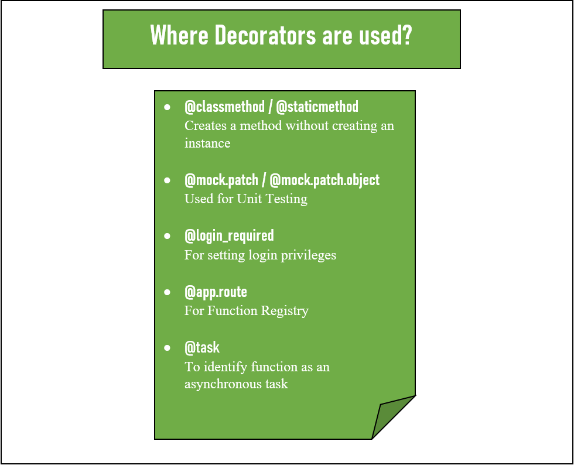
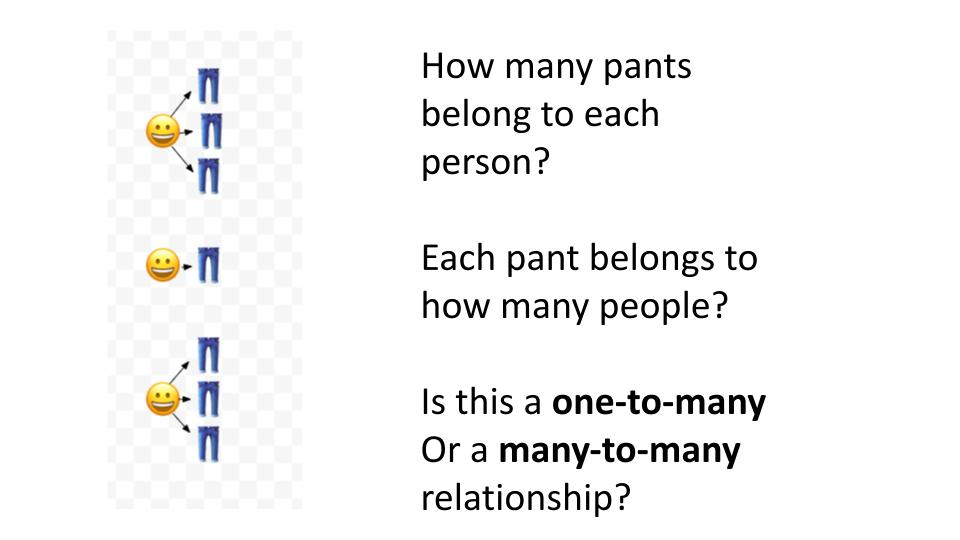
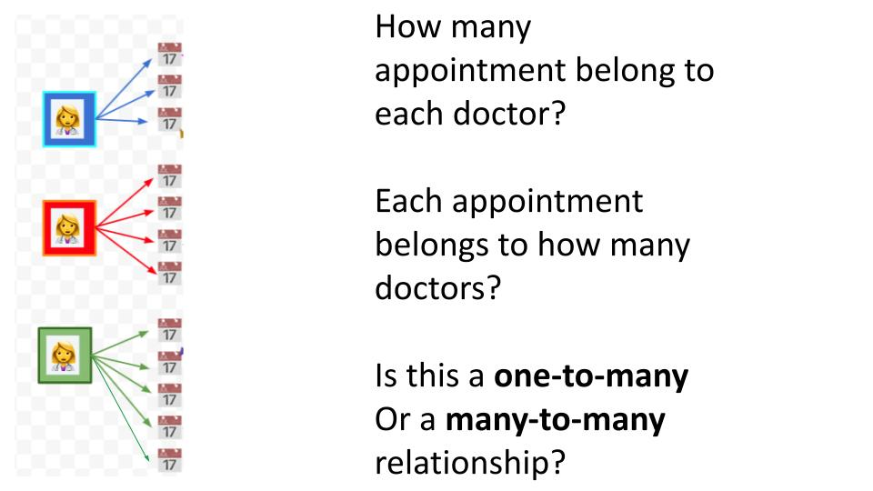
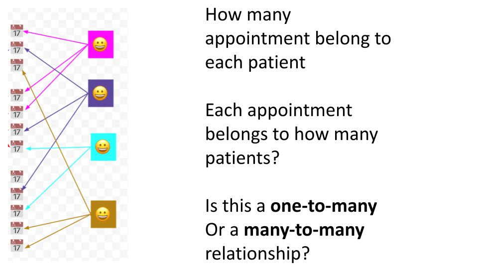
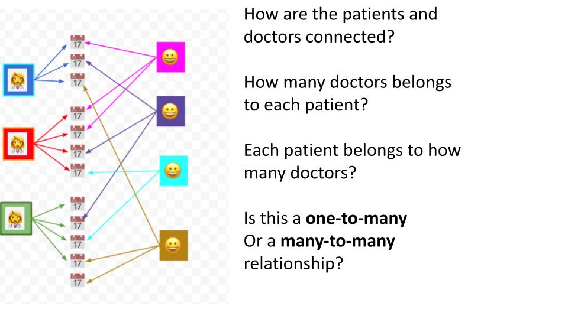
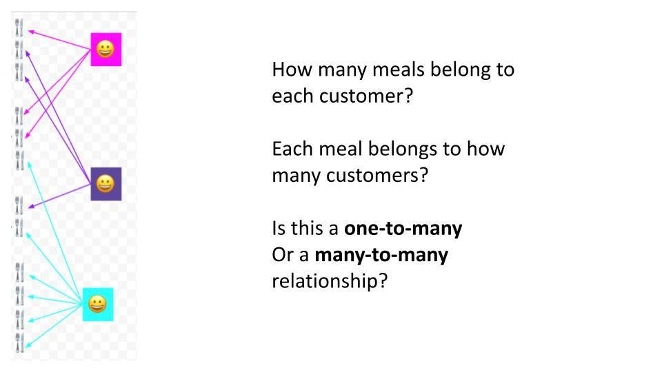
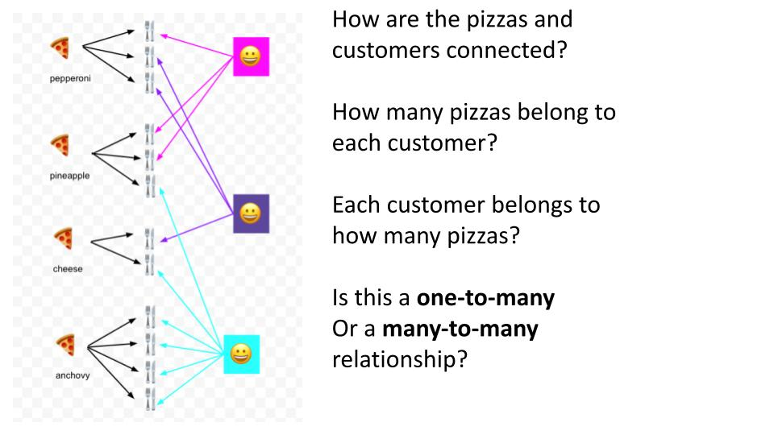
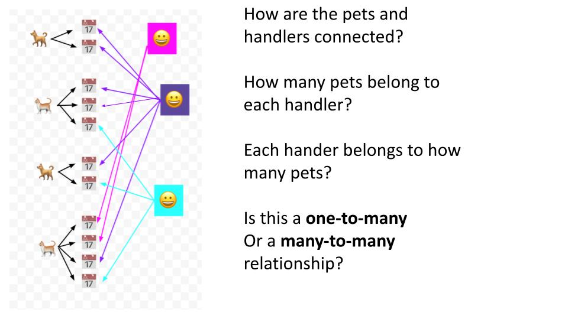

<h2>OOP 2: Class Methods, Class Variables & Object Relationships</h2>


---

<h3><strong> ✅ Objectives </strong></h3>


- Learn about decorators
  - what are they? {.fragment}
  - how are they useful in Python classes? {.fragment}
  - Python's "pie" syntax {.fragment}
- Understand class variables {.fragment}
  - how to define and update their value {.fragment}
- Write class methods {.fragment}
  - use the `@classmethod` decorator {.fragment}
  - `cls` keyword {.fragment}

xxx

- Object inheritance {.fragment}
  - how is it useful? {.fragment}
  - inherited or overwritten? {.fragment}
  - calling `super()` {.fragment}

xxx

- Build one-to-many relationships between objects {.fragment}
    - Discuss their importance and use {.fragment}
    - Emphasize single-source-of-truth {.fragment}
    - Demonstrate building one-way and two-way relationships {.fragment}
- Build many-to-many relationships between objects {.fragment}
    - Discuss their importance and use {.fragment}
    - Demonstrate building the relationship with and without intermediary class {.fragment}
- Aggregate Methods {.fragment}
    - Write aggregate methods to collect data about objects using their related objects {.fragment}


---

#### What are decorators? 🪴 🛋️


---

<div style="display: flex;">
  <div style="width: 40%; height: 100%">
    <p>Decorators give us an easy way to extend a method's functionality without altering the method.</p>
  </div>

  <div style="width: 60%; height: 100%">
    
  </div>
</div>


---

#### Decorators are higher-order functions


<p>They take in a function as an argument, and return a function.</p>

<p class="fragment" >The "pie", <code>@decorator</code>, syntax makes decorators easier to implement in our code.</p>

#### Let's try it! 🏈 {.fragment}

---

### Class Variables

<div style="display: flex">
  <div style="width: 50%">
    
  </div>
  <div style="width: 50%; text-align: left">
    We have used instance variables (attributes) to assign unique values to instances of a class. How could we assign a univeral value which would be the same for all instances?
  </div>

</div>

---


<p>Every object instantiated from the class has read and write access to its class variables.</p>

---

<section>
    <pre><code class="language-python" data-trim data-noescape data-line-numbers="1-2|1-3">
      class Pet:
        total_pets = 0
        all = []
    </code></pre>
    <ul>
      <li>class variables are espcially useful for tracking cumulative data about all of the objects instantiated</li>
      <li class="fragment">a list can even be used to keep a reference to every object itself!</li>
    </ul>
   
</section>

---

### Class Methods

#### What about behaviors that are universal to the class?


---

<section>
    <pre><code class="language-python" data-trim data-noescape data-line-numbers="4-6">
      class Pet:
        total_pets = 0
        all = []
        @classmethod
        def add_to_total_pets(cls):
          cls.total_pets += 1
    </code></pre>
    <pre><code class="language-python" data-trim data-noescape data-line-numbers="1-2|1-3">
      Pet.add_to_total_pets()
    </code></pre>
    <ul>
      <li>Just as we can give a class attributes with class variables, we can also give it behavior with class methods.</li>
      <li class="fragment">these methods often update the values of the class variables in some way</li>
    </ul>
    <h5 class="fragment">Let's get hacking! 🕶️</h5>
</section>

---

#### Object Inheritance

<div style="display: flex">
  <div style="width: 45%">
    
  </div>
  <div style="width: 55%; text-align: left; font-size: 2rem">
    <ul>
      <li>Just as we've extended the functionality of methods with decorators</li>
      <li class='fragment'>We can extend the functionality of a class with inheritance</li>
      <li class='fragment'>Inheritance let's us create a family of classes which share traits</li>
      <li class='fragment'>While still keeping our code DRY</li>
    </ul>
  </div>
</div>

---


<p>Heirarchical inheritance with common and differentiated attributes</p>

---


---

#### Method overriding

```python
class Vehicle:
    def vehicle_info(self):
        print("Inside Vehicle Class")

    def max_speed(self):
        print("max speed is 100 Km/Hour")


class Car(Vehicle):
    def car_info(self):
        print("Inside Car Class")

    # overridden the implementation of Vehicle class
    def max_speed(self):
        print("max speed is 200 Km/Hour")
```

xxx

```python
# Creating object of Car class
car = Car()
car.vehicle_info() # => "Inside Vehicle Class"
car.car_info() # => "Inside Car Class"
car.max_speed() # => "max speed is 200 Km/Hour"
```

---

#### `super()` method

The super function returns a temporary object of the parent class that allows us to call a parent class method inside a child class method.

##### Benefits of using the `super()` function

- We are not required to remember or specify the parent class name to access its methods. {.fragment}
- We can use the `super()` function in both single and multiple inheritances. {.fragment}
- The `super()` function support code reusability as there is no need to write the entire function {.fragment}

xxx

```python
class Company:
    def company_name(self):
        return 'Google'

class Employee(Company):
    def info(self):
        # Calling the superclass method using super()function
        c_name = super().company_name()
        print("Jessa works at", c_name)

# Creating object of child class
emp = Employee()
emp.info()
```

### Let's do it! 🏃‍♂️ {.fragment}

---



---



---



---



---


---



---



---



---

- A sale may have multiple coupons but a coupon can only be used on one sale at a time.
- A person can have one or more family members, a family can have any number of people. {.fragment}
- A book is assigned to one library at a time but a library holds a bunch of books {.fragment}
- A fan can go to multiple concerts and a concert can have multiple fans  {.fragment}


